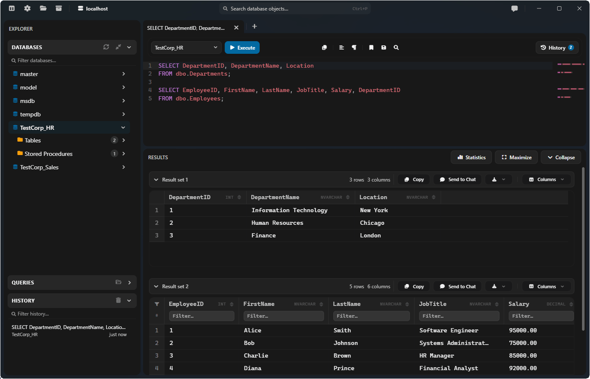

<!-- markdownlint-disable MD033 MD041 -->
<div align="center">
  

# SQL Query Studio

A lightweight desktop SQL editor for Microsoft SQL Server.

[](LICENSE)
[](https://github.com/crsxmilitaru/sqlqs/releases)

</div>

---

**SQL Query Studio (`sqlqs`)** is a lightweight, cross-platform client for querying and administering Microsoft SQL Server on Windows and macOS. Built with SolidJS, Tauri v2 (Rust), and a .NET 10 database sidecar for high-performance query execution and SMO operations.

<p align="center">
  
</p>

## Install

Download the latest stable release or preview build from [Releases](https://github.com/crsxmilitaru/sqlqs/releases).

## Features

- **Editor**: Syntax highlighting, autocomplete, code formatting, minimap, and multi-tab queries
- **Results Grid**: Column visibility toggles, sorting, filtering, inline row editing, and Excel / CSV / JSON export
- **Object Explorer**: Schema navigation and quick jump search (`Ctrl+P` / `Cmd+P`) for tables, views, procedures, functions, triggers, and types
- **Saved Queries & History**: Query bookmarking and searchable execution history
- **Administration & Scripting**: Object properties, dependency tracking, DDL scripting, and database backup/restore
- **AI Assistant**: Integrated Gemini chat to generate, explain, and troubleshoot SQL queries
- **Safety & Security**: Secure credential storage via OS keychain and safety guardrails (confirmation prompts before destructive queries like `DROP`, `TRUNCATE`, or `UPDATE`/`DELETE` without `WHERE`)
- **Theming**: Built-in themes (Dark, Dracula, Light, Midnight, OLED, Soft Light) plus custom themes support

## Usage

1. Click **Connect Server** and connect using SQL Server Authentication, Windows Authentication, or a custom connection string.
2. Browse database objects in the explorer, or press `Ctrl+P` / `Cmd+P` to quickly jump to any object.
3. Execute SQL queries with `F5` or `Ctrl+Enter` (`Cmd+Enter` on macOS).

## Development

### Prerequisites

- Node.js 22+
- Rust (stable toolchain)
- .NET 10 SDK (see `global.json`)
- [Tauri v2 prerequisites](https://v2.tauri.app/start/prerequisites/)

### Setup & Run

```bash
git clone https://github.com/crsxmilitaru/sqlqs.git
cd sqlqs
npm run setup
npm start
```

- `npm start`: Builds the debug sidecar and launches the desktop app with hot reload.
- `npm run dev`: Starts frontend-only development mode in the browser.

### Build & Test

```bash
# Build desktop production installers (output in src-tauri/target/release/bundle/)
npm run tauri:build

# Lint frontend
npm run lint

# Run Rust host tests
cargo test --manifest-path src-tauri/Cargo.toml
```

---

<p align="center">
  <strong>💖 Support the Development</strong><br><br>
  If you find this project useful, consider buying me a coffee!<br><br>
  <a href="https://www.paypal.com/donate?hosted_button_id=MZQS5CZ68NGEW">
    
  </a>
</p>

---

<p align="center">
  <strong>🙏 Thank you for using SQL Query Studio!</strong>
</p>
